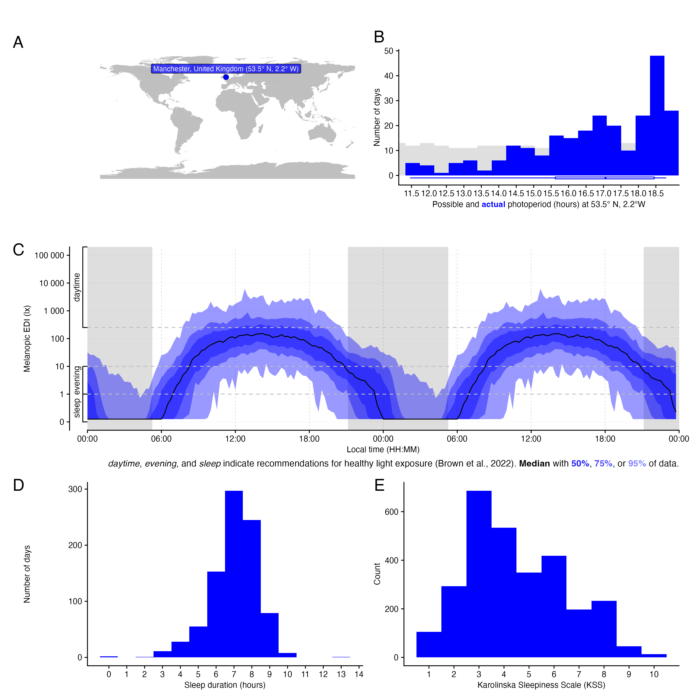

<!-- README.md is generated from README.Rmd. Please edit that file -->

### The dataset provided here is a combined and harmonised collection of personal light exposure, sleep, and subjective sleepiness data from Manchester, UK, spanning multiple phases of the study.

**Version v1.0.0**

<figure>

<figcaption aria-hidden="true">Overview of light exposure data. (A)
location of data collection, (B) possible and available photoperiods,
(C) double plot of median, interquartile range (50%), 75%, and 95%
ribbons of light exposure across all participants, shaded areas indicate
nighttime from civil dusk to civil dawn, (D) histogram of sleep
duration, and (E) histogram of sleepiness scores.</figcaption>
</figure>

### About this repository

This dataset comprises personal light exposure data collected in
Manchester, UK, by the [University of
Manchester](https://www.manchester.ac.uk/) using the
[Spectrawear](https://ieeexplore.ieee.org/document/10401974) wrist-worn
light sensor device, which measures melanopic lux exposure. The
protocols require participants to wear the light logger during daytime
and remove it during sleep, placing it on the bedside table in the same
room near eye level.

The first phase of data collection was conducted using a real-world data
collection protocol, as described in Didikoglu et al. (2023),
“Associations between light exposure and sleep timing and sleepiness
while awake in a sample of UK adults in everyday life” (DOI:
[10.1073/pnas.2301608120](https://www.pnas.org/doi/10.1073/pnas.2301608120)).
The complete dataset associated with this publication is available on
Figshare (DOI: [10.48420/23786238](https://doi.org/10.48420/23786238)).

The second phase of data collection followed an enhanced protocol
published on Protocols.io (DOI:
[10.17504/protocols.io.n92ldrjjxg5b](https://dx.doi.org/10.17504/protocols.io.n92ldrjjxg5b/v1)).
In this protocol, the same data as in Phase 1 were collected, along with
additional cognitive and light sensitivity measures. The corresponding
dataset can be accessed via Figshare (DOI:
[10.48420/28911977](https://doi.org/10.48420/28911977)).

The dataset presented here is a combined and harmonised compilation of
personal light exposure, sleep, and subjective sleepiness data from
multiple phases of research conducted in Manchester, UK. Light exposure
records of less than two days in duration were excluded from the
dataset. Sleep and sleepiness data are included only when corresponding
light exposure data are available.

### Citation

APA reference:

> Didikoglu, A. (2025). Personal light exposure, sleep, and subjective
> sleepiness data from Manchester, UK (Version 1.0.0) \[Data set\]. URL:
> <https://github.com/altugdidikoglu/UK_Wearable_Light_Dataset>.

## Summary of the dataset

<table>
<colgroup>
<col style="width: 57%" />
<col style="width: 42%" />
</colgroup>
<tbody>
<tr class="odd">
<td>Period of data collection (total)</td>
<td>February 2022 – August 2023</td>
</tr>
<tr class="even">
<td>Location</td>
<td>Manchester, UK</td>
</tr>
<tr class="odd">
<td>Number of participants included in this repository</td>
<td>N = 105</td>
</tr>
<tr class="even">
<td>Duration of experiment for each participant</td>
<td>7 days (starting from any weekday)</td>
</tr>
<tr class="odd">
<td>Age</td>
<td>All participants aged 18 and above: 
29% aged 18–25 
36% aged 26–30 
21% aged 31–35</td>
</tr>
<tr class="even">
<td>Sex</td>
<td>56% Female</td>
</tr>
<tr class="odd">
<td>Employment status</td>
<td>48% Full-time 
12% Part-time 
38% Student</td>
</tr>
<tr class="even">
<td>Chronotype (MCTQ MSFsc)</td>
<td>Mean = 4.90 
SD = 1.48 
Min = 0.58 
Max = 8.25</td>
</tr>
<tr class="odd">
<td>Sleep quality (PSQI)</td>
<td>Mean = 5.64 
SD = 2.18 
Min = 1 
Max = 12</td>
</tr>
</tbody>
</table>

### Included files

The following files are included with this Dataset:

        data/
            light_data_uk.RData
            sleep_data_uk.RData
            kss_data_uk.RData
            sample_data_uk.RData

- `LICENSE`: Licensing terms. This dataset is published with a
  permissive CC0-1.0 license

All data are anonymous.

Each data file includes information from all participants.

| File name          | Content                                                                                                                                                                                                                                                                                                                                                                                           |
|--------------------|---------------------------------------------------------------------------------------------------------------------------------------------------------------------------------------------------------------------------------------------------------------------------------------------------------------------------------------------------------------------------------------------------|
| **light_data_uk**  | **MEDI**: Melanopic Equivalent Daylight Illuminance (lux), recorded every 30 seconds. **Datetime**: Measurement timestamps are in local time (“Europe/London” timezone).                                                                                                                                                                                                                          |
| **sleep_data_uk**  | **Datetime**: Survey completion timestamps are recorded in local time (“Europe/London” timezone). Wake and sleep times are also reported in local time. **Sleep duration**: Subjectively reported total sleep duration (in hours). **Sleep latency**: Time taken to fall asleep (in hours). **Sleep quality**: Self-reported using a 5-point Likert scale ranging from *very bad* to *very good*. |
| **kss_data_uk**    | **KSS**: Karolinska Sleepiness Scale, ranging from 1 to 10 (where 10 indicates the highest level of sleepiness). **Datetime**: Survey completion timestamps are recorded in local time (“Europe/London” timezone).                                                                                                                                                                                |
| **sample_data_uk** | Demographic information for the sample includes age, sex, employment status, and subjective chronotype categories. Additionally, sleep midpoint time (MSFsc) was measured using the Munich Chronotype Questionnaire, and sleep quality was measured using the Pittsburgh Sleep Quality Index.                                                                                                     |
